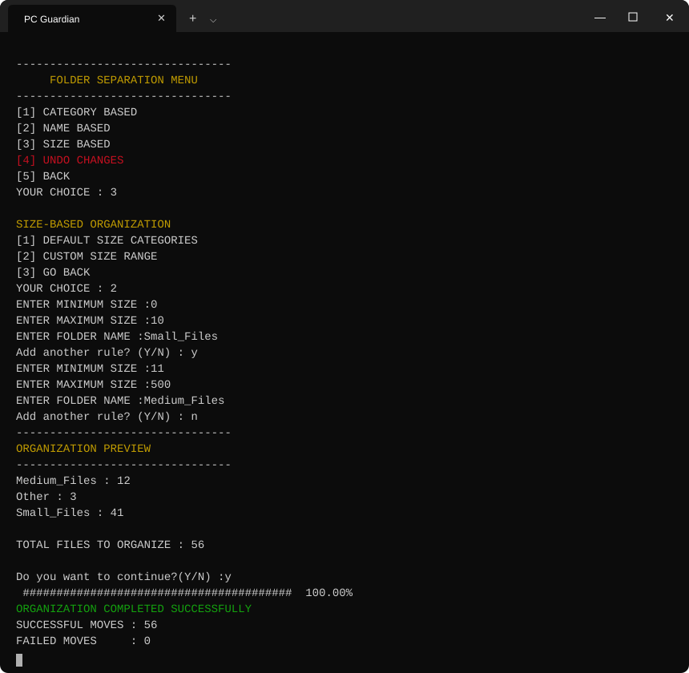
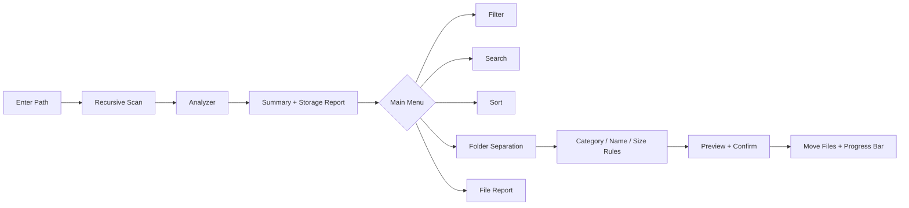

<div align="center">

# 🛡️ PC Guardian

### Smart File & System Health Manager

*Scan. Analyze. Filter. Organize — all from your terminal.*


</div>

> 🤖 **Note:** This README was **generated by AI** as a temporary placeholder while the project is under development. The author will write the final, official README personally once the project is complete. The terminal previews below are AI-generated illustrations based on the program's source code; real screenshots will be added later.

---

## 📑 Table of Contents

- [About](#-about)
- [Origin Story](#-origin-story)
- [Features](#-features)
- [Terminal Preview](#-terminal-preview)
- [Folder Separation](#-folder-separation-in-detail)
- [How It Works](#-how-it-works)
- [Tech Stack](#-tech-stack)
- [Build & Run](#-build--run)
- [What's Next](#-whats-next)
- [Concepts Practiced](#-concepts-practiced)
- [Author](#-author)

---

## 📖 About

**PC Guardian** is a console-based file management tool written in **C++**. Point it at any folder (or a single file) and it will recursively scan everything inside, build a clear storage report, and give you tools to **filter, search, sort and automatically organize** your files.

It is also my way of learning C++ the fun way: instead of solving 100 textbook problems, I built something I would actually use. OOP, STL, lambdas, `std::filesystem`, `<chrono>` — all of it, in one app. 😄

### 🤔 Origin Story

> *Me, staring at my laptop at some random hour:*
> **"Bhai... itna storage kaise bhar gaya?! 😭"**

No idea what was eating my disk. Downloads folder = a battlefield. Total chaos. I could have just opened Windows Storage settings like a normal person, but nope, I decided to write a C++ program instead. Classic.

That is how PC Guardian was born: first it only *told* me where my storage went, then I got tired of cleaning manually, so it learned to **organize the mess by itself**. 🧹

---

## ✨ Features

| Module | What it does |
|---|---|
| 🔍 **Recursive Scanner** | Walks through all sub-folders with a live animated scanning bar; safely skips permission-denied entries and reports how many were skipped |
| 📊 **Storage Analyzer** | Total storage, largest file, extension count, and **category-wise usage with percentage bars** |
| 🎯 **File Filter** | Filter by **extension**, **category**, or **size range** (KB / MB / GB / TB) |
| 🔎 **File Search** | Case-insensitive partial-name search across the whole scan |
| ↕️ **File Sort** | Sort by **size**, **name**, **extension** or **date** (ascending / descending) |
| 📁 **Folder Separation** | Auto-organize files into folders — **Category based ✅**, **Name based ✅** and **Size based ✅** (with preview + confirmation before anything moves) |
| 📄 **File Report** | Detailed single-file report: name, location, extension, size, category, size type. Also works when you give the program a single file path instead of a folder |
| 🕒 **Last Modified Date** | Human-readable timestamps via `<chrono>` + `put_time` |
| 🎨 **Colored UI** | ANSI colored menus, status messages and progress bars |

---

## 🖥️ Terminal Preview

### 1️⃣ Startup & Scan Summary


### 2️⃣ Storage Analysis, Largest Files & Main Menu


### 3️⃣ File Report


---

## 📁 Folder Separation in Detail

This is the part where PC Guardian stops being a *reporter* and becomes a *cleaner*. Every mode follows the same safe flow: **build rules ➜ show an Organization Preview ➜ ask for confirmation ➜ move files with a live progress bar**.

### ✅ Category Based

Files are grouped automatically by type (Videos, Images, Audio, Documents, Applications, Archives, Coding). Anything the tool does not recognise (including files with no extension) goes into an `other` folder. Before anything is moved, the tool lists **which folders will be created** and asks for confirmation, then shows a preview and a live progress bar.


**Before ➜ After**

```text
Downloads/                      Downloads/
├── holiday.jpg                 ├── Images/
├── song.mp3                    │   └── holiday.jpg
├── notes.pdf          ───►     ├── Audio/
├── trip.mp4                    │   └── song.mp3
└── backup.zip                  ├── Documents/
                                │   └── notes.pdf
                                ├── Videos/
                                │   └── trip.mp4
                                └── Archives/
                                    └── backup.zip
```

### ✅ Name Based

Create **custom rules**: a *keyword* ➜ a *folder name*. Any file whose name contains the keyword (case-insensitive, so `ARYAN` = `aryan`) lands in that folder. Add as many rules as you like — you are the boss here. 😎

If a file matches more than one rule, the **first rule wins**. Files that match no rule are collected into an `Other` folder.


| Keyword | Folder | Example match |
|---|---|---|
| `invoice` | `Bills/` | `invoice_march.pdf` |
| `resume` | `Career/` | `my_resume_v2.docx` |
| `holiday` | `Trips/` | `holiday_goa.jpg` |

### ✅ Size Based *(new in this version!)*

Organize by how big your files are. Two modes:

**1️⃣ Default size categories**

The tool looks at the largest file in your scan and splits the range into three equal buckets:

| Folder | Rule |
|---|---|
| `Small/` | size below ⅓ of the largest file |
| `Medium/` | between ⅓ and ⅔ of the largest file |
| `Large/` | everything bigger |

**2️⃣ Custom size range**

Define your own rules: a **minimum size (MB)**, a **maximum size (MB)** and a **folder name**. Add as many rules as you want.

- Invalid ranges (negative values, min greater than max) are rejected
- **Overlapping ranges are blocked**, so one file can never be claimed by two rules
- Files that fit no range go to an `Other` folder



| Min (MB) | Max (MB) | Folder | Example match |
|---|---|---|---|
| `0` | `10` | `Tiny/` | `notes.pdf` (2 MB) |
| `11` | `500` | `Chunky/` | `lecture.mp4` (240 MB) |
| `501` | `5000` | `Heavy/` | `game_setup.exe` (2.1 GB) |

### 🚧 Undo Changes

Still cooking in the kitchen. 🍳 It is marked **under development** in the app, so for now every move is final.

---

## ⚙️ How It Works



**Core design**

- `FileInfo` class — encapsulates name, extension, relative path, size and last write time
- `AnalysisResult` struct — holds totals, largest file and category/extension statistics
- `NameRule` and `sizeRule` structs — hold the user-defined rules for name based and size based organization
- `createCategoryMap()` — maps extensions to categories using `std::map`
- Sorting uses **lambda functions** on a *copy* of the vector, so the original scan order is never disturbed
- Every organization mode produces a `vector<pair<FileInfo, string>>` (file ➜ target folder), which is shown as a preview and then handed to a single shared `processOrganization()` function
- File moves use `fs::rename` with `std::error_code` for safe, exception-free error handling
- If a file with the same name already exists in the target folder, the moved file is renamed automatically (`photo.jpg` ➜ `photo_1.jpg`) instead of overwriting anything

---

## 🧰 Tech Stack

| | |
|---|---|
| **Language** | C++ (uses `<format>`, so C++20 is required) |
| **Libraries** | STL, `<filesystem>`, `<chrono>`, `<iomanip>`, `<algorithm>`, `<set>`, `<sstream>` |
| **Interface** | Console / Terminal (ANSI colors) |
| **Compiler** | GCC 13+ / Clang 16+ / MSVC 2022 |

---

## 🚀 Build & Run

```bash
# Clone
git clone https://github.com/Aryangupta-builds/PC-Guardian.git
cd PC-Guardian

# Compile (C++20 required)
g++ -std=c++20 -O2 main.cpp -o pc_guardian

# Run
./pc_guardian          # Linux / macOS
pc_guardian.exe        # Windows
```

> 💡 On Windows, use **Windows Terminal** or a recent PowerShell/CMD so ANSI colors render correctly.

> ⚠️ **Safety tip:** Folder Separation **moves real files**. Please test on a sample folder first (do not start with your wedding photos 😅) — the *Undo* feature is not available yet.

---

## 🗺️ What's Next?

PC Guardian is a **long-term project** and the road ahead is still pretty long. No full spoilers here (the author likes surprises 🤫), but here is the general idea of where it is heading:

| | Status | The vibe |
|---|---|---|
| 🧱 **Foundation** | ✅ Done | Scanner, analyzer, recursive scanning, progress bars, human-readable sizes |
| 🗂️ **File Intelligence & Organization** | ✅ Mostly done | Filter, search, sort, reports and all three folder separation modes (category, name, size) |
| ↩️ **Safety nets** | 🔨 Next up | Undo for organization, smarter handling of edge cases |
| 🔎 **Smart cleanup** | 🔜 Planned | Duplicate files, large files and old files detection |
| 💻 **System health** | 🔜 Planned | CPU / RAM / Disk info and health reports |
| 🤖 **Automation** | 💭 Dreaming | A PC Guardian that quietly keeps your folders tidy in the background |
| ✨ **Polish** | 💭 Dreaming | Cleaner UX, stronger error handling, a real Windows-utility feel |

> The exact plan lives in the author's head (and a very long notes file). 😄

### 🐛 Known Quirks (being honest here)

- After files are organized, the in-memory scan is **not refreshed**. Restart the program (or re-scan) before running filter, search or another organization, otherwise it will still look for files at their old locations.
- Custom size ranges accept **whole numbers of MB only** for now (no `1.5`).
- Unrecognised files go to `other` in category mode but `Other` in name and size mode. Windows treats these as the same folder, but Linux/macOS would not.
- A category folder that **already existed** before organizing may be left behind empty, and emptied sub-folders are not cleaned up.
- If any entry is skipped during the scan (for example permission denied), the scan status shows as `INVALID` even though the rest of the results are fine.
- Permission-denied scenarios on Windows are still waiting for proper testing.

These are on the to-do list, not forgotten. 📝

---

## 🎓 Concepts Practiced

`OOP & Encapsulation` · `std::vector` · `std::map` · `std::set` · `std::pair` · `Structs` · `Lambda functions` · `std::filesystem` · `std::error_code` · `<chrono>` & `put_time` · `Input validation` · `ANSI escape codes` · `Modular functions`

---

## 👤 Author

**Aryan Gupta**
BCA student & C/C++ learner, building real-world projects.

[](https://github.com/Aryangupta-builds)

> 🤖 *This README was created with the help of AI. The official README will be written by the author.*

---

<div align="center">⭐ If you like this project, give it a star! ⭐</div>
